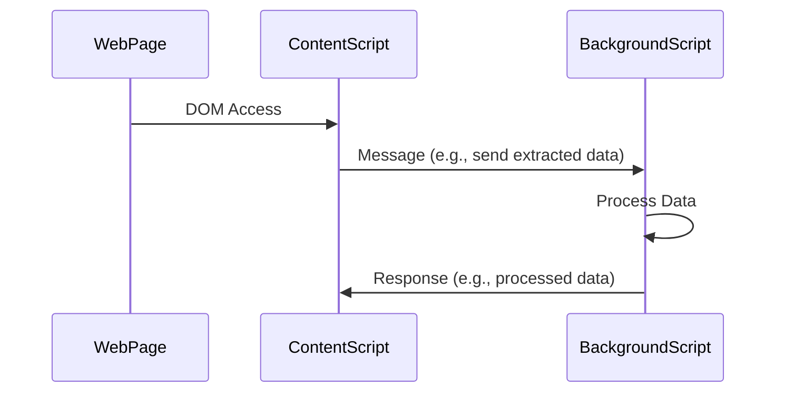

# Chrome Extension Template  

## **What's Included in This Template?**  
This Chrome extension template comes with the following features and tools:  
- **TypeScript** for type safety.  
- **pnpm** as the package manager.  
- **Vite** for fast development and build setup.  
- **React** for building UI components.  
- **TailwindCSS** for styling.  
- **Service Worker** for background tasks.  
- **Content Script** for interacting with web pages.  
- `"@"` as a path alias for cleaner imports.  
- Include Auto-Build Script `./scripts/watch-build.sh`
- Pre-configured and ready to use.  
- Battle-tested for reliability.  

## **Key Files to Check in This Project**  
Here are some important files you might want to review:  
- `vite.config.ts`: Configuration for Vite.  
- `public/manifest.json`: The extension's manifest file.  
- `package.json`: Project dependencies and scripts.  
- `tailwind.config.js`: Configuration for TailwindCSS.  

## **About the Auto-Build Script**  

This project uses `./scripts/watch-build.sh` instead of `tsc -b --watch` for building the extension.  

### **Why Use a Custom Script?**  
- **Chrome Extension Specific Needs:**  
  `tsc` is great for general TypeScript projects but doesn't handle tasks like bundling or minifying files, which are crucial for extensions.  

- **File-Specific Handling:**  
  - **`content-script.js`:** Must be bundled as a standalone script (no ES modules).  
  - **`service-worker.js`:** Supports ES modules but benefits from optimization.  

- **Integrated Process:**  
  The custom script simplifies bundling, minification, and compression, ensuring the build process fits Chrome extension requirements.  

### **tsc and vite build**

Additioanlly, you can use `pnpm watch` or the line below to make sure our project is compile correctly instead of using Auto-Build Script.

```json
"watch": "concurrently \"tsc -b --watch\" \"vite build --watch\""
```

## **Take Note**  

When working with `content-script.js` and `service-worker.js`, you need to use two different Chrome consoles.  

### **1. For `content-script.js`**  
- Use the standard Chrome DevTools console.  
- Inspect any website where your content script is running to access the console.  

### **2. For `service-worker.js`**  
To access the console for `service-worker.js`:  
1. Navigate to `chrome://extensions/`.  
2. Enable **Developer mode** (toggle it at the top-right corner).  
3. Find your extension on the same page and click **Inspect views: service worker**.  
4. A new developer console will open, where you can view logs and debug your service worker.  

## A bit of reading

A Chrome extension has three main parts:

1. `popup.html` (in our project, it's `main.tsx`)  
2. `content-script.js` (or `content.ts`)  
3. `service-worker.js` (or `background.js`)  

The `popup.html` or `main.tsx` is simple and easy to understand for any frontend developer, so it doesn’t need much explanation.  

This guide will focus on `content-script.js` and `service-worker.js`.  

## Default Behaviors

### **Background Scripts (`service-worker.js`/`background.js`)**

- **Default Behavior:**  
  In Manifest V3, background scripts are treated as **ES modules**. You specify them in the `background.service_worker` field of the `manifest.json` file, and they must use the `type: module` syntax.  
- **Why It Matters:**  
  This allows you to use `import` and `export` statements directly, making it easier to organize your code into reusable modules.

**Example:**
```json
"background": {
  "service_worker": "background.js",
  "type": "module"
}
```
For more details, see [service-worker.js documentation](https://developer.chrome.com/docs/extensions/reference/manifest/background).

### **Content Scripts (`content-script.js`/`content.js`)**

- **Default Behavior:**  
  Content scripts are treated as **non-module scripts**. This means they don’t support `import` and `export` directly. Content scripts run in the context of a web page and have limitations based on that environment.  
- **Why It Matters:**  
  If you want to use module syntax in your content script, you’ll need a bundler like Vite, Webpack, or Rollup to combine your code into a single file.

**Example:**
```json
"content_scripts": [
  {
    "matches": ["<all_urls>"],
    "js": ["content.js"]
  }
]
```
For more details, see [content-script.js documentation](https://developer.chrome.com/docs/extensions/reference/manifest/content-scripts).

## Why Are Background Scripts Treated as Modules by Default but Content Scripts Are Not?

The difference between how background scripts and content scripts are treated in Chrome Extensions relates to their **execution environments**, **functionality**, and **security model**.

### **1. Execution Environment**
- **Background Scripts (Service Workers):**
  - Run in an isolated environment, separate from web pages.
  - Have direct access to Chrome's extension APIs and operate independently of the web page's context.
  - Using ES modules makes it easier to organize code with modern JavaScript practices, such as `import` and `export`, and prevents global namespace pollution.

- **Content Scripts:**
  - Run directly in the web page's environment, interacting with the DOM but with limited access to Chrome's APIs (they use messaging to communicate with background scripts).
  - Must work seamlessly with the web page's JavaScript, which may not support ES modules or could have conflicting variables.
  - Keeping content scripts as non-modules ensures better compatibility and avoids interfering with the page's environment.

### **2. Security Model**
- **Background Scripts:**
  - Operate in a secure, isolated environment with minimal risk of interference from web page scripts.
  - Using modules enhances security by scoping variables and avoiding accidental namespace collisions.

- **Content Scripts:**
  - Execute in a shared environment alongside web page scripts.
  - Using non-modules ensures compatibility with pages that might not support ES modules and avoids potential issues with older JavaScript standards.


### **3. Purpose and Use Cases**
- **Background Scripts:**
  - Handle long-running tasks like event listeners, API calls, or managing state for the extension.
  - Modules are ideal for building maintainable, modular code for these complex tasks.

- **Content Scripts:**
  - Interact with the web page's DOM, modify content, or extract data.
  - A non-module approach keeps them lightweight and ensures they work well with the page’s existing JavaScript.

### **4. Performance and Compatibility**
- **Background Scripts:**
  - Benefit from module features like lazy-loading and tree-shaking, which improve performance for large codebases.
  - Since they run in isolation, there are no compatibility concerns with web page scripts.

- **Content Scripts:**
  - Injected into the web page environment, where non-modules avoid compatibility issues and reduce performance overhead related to loading ES modules.

### **Key Takeaways**
- **Background Scripts:** Treated as modules by default because they run in a controlled, isolated environment where modularity and performance optimizations are beneficial.
- **Content Scripts:** Not treated as modules to ensure compatibility with web pages and avoid potential conflicts with their JavaScript environment.

## Where do they execute?

### **Content Script**
- **Injected into the Web Page:**
  - A content script runs directly in the context of the web page that the user visits.
  - It interacts with the **DOM** of the page, can read or modify its content, and listen to user actions.
  - It runs in a sandboxed environment, meaning it has no direct access to the web page's JavaScript variables or objects unless explicitly injected (via script injection).

- **Environment:**
  - Sandboxed execution environment shared with the web page, but isolated from the Chrome extension's own environment.
  - Cannot directly use Chrome Extension APIs like `chrome.runtime` (except for specific APIs like messaging and storage).

### **Background Script**
- **Runs in Chrome's Isolated Extension Environment:**
  - The background script (or service worker in Manifest V3) does not run in the context of any web page. Instead, it runs in an isolated environment managed by Chrome.
  - It has access to all the privileged Chrome Extension APIs, such as `chrome.runtime`, `chrome.tabs`, `chrome.storage`, and `chrome.webRequest`.

- **Purpose:**
  - Handles long-running tasks, extension lifecycle events, and manages communication between content scripts and other parts of the extension.
  - It acts as the "brain" of the extension, coordinating various components like content scripts, popup scripts, and options pages.

### **Key Differences**
| **Aspect**            | **Content Script**                              | **Background Script**                       |
|-----------------------|------------------------------------------------|--------------------------------------------|
| **Execution Context** | Web page environment (sandboxed)               | Chrome extension's isolated environment    |
| **Injected?**         | Yes, into specific web pages                   | No, runs persistently or as a service worker |
| **Access to DOM?**    | Yes, can directly manipulate the page's DOM    | No, cannot access web pages' DOM           |
| **Access to APIs?**   | Limited (e.g., `chrome.runtime`, `chrome.storage`) | Full access to Chrome Extension APIs       |
| **Communication**     | Sends messages to background or other scripts  | Manages communication across all components |

### **Example: Communication Flow**
1. **Content Script**: Injected into a web page, it modifies the page's DOM or extracts information.
   - Example: Reading a webpage's title.
2. **Background Script**: Processes information, interacts with Chrome APIs, and sends data back to the content script.
   - Example: Logging the title to the extension's storage or fetching additional data from an external API.

**Flow Example:**

